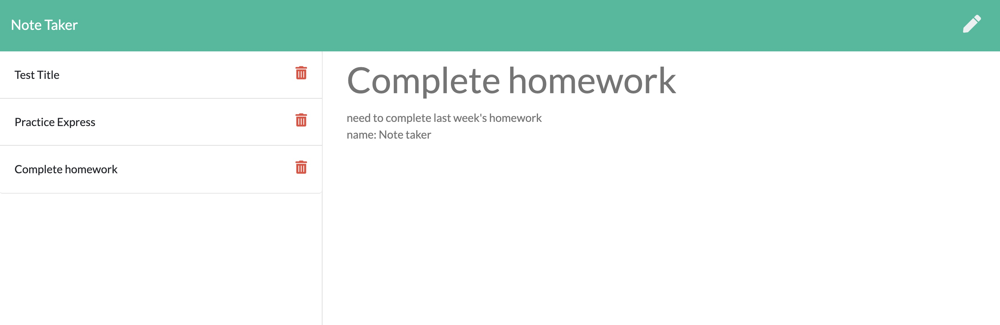

# Note Taker
  
   
  ## Table of Contents:
  

  * [Description](#description)
  * [Installation instructions](#InstallationInstructions)
  * [Usage](#Usage)
  * [Contributors](#Contributors)
  * [Tests](#Tests)
  * [License](#License)
  * [Questions](#Questions)

    
  
    
  ## [Description](#description)
  

  In this application user wil be able to add notes with title and description. Each note will be saved on left column. When any note is clicked, the details will show on the right column. User has an option to delete any note.
    
  ## [Installation instructions](#InstallationInstructions)
  

  No installation is required. Open the website with following link https://git.heroku.com/enigmatic-badlands-09707.git
    
  ## [Usage](#Usage)
  

  
    
  ## [Contributors](#Contributors)
  

  
    
  ## [Tests](#Tests)
  

  No tests are present at the moment
   
  
    
  ## [License](#License)
  

  Copyright (c) Kuba Z Production. All rights reserved.
	Licensed under the Apache 2.0 License.
    
  ## [Questions](#Questions)
  

  If any questions dont hesitate to reach out.  
  Github username: [kZhaanbaev](https://github.com/kZhaanbaev)  
  email: k.zhaanbaev4@gmail.com
